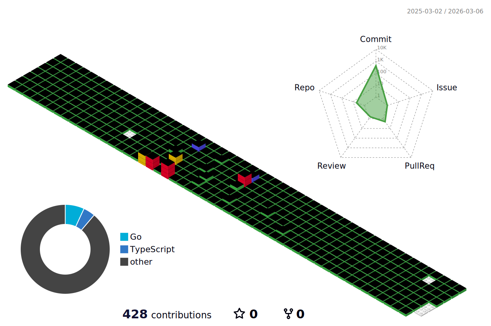

 <!-- Java -->
 <!-- Spring -->
 <!-- Redis -->
 <!-- JPA (Hibernate) -->
 <!-- Oracle -->
 <!-- MySQL -->
 <!-- Python -->
 <!-- Selenium -->
 <!-- JavaScript -->
 <!-- jQuery -->
 <!-- Vue.js -->
 <!-- React -->
 <!-- Next.js -->

