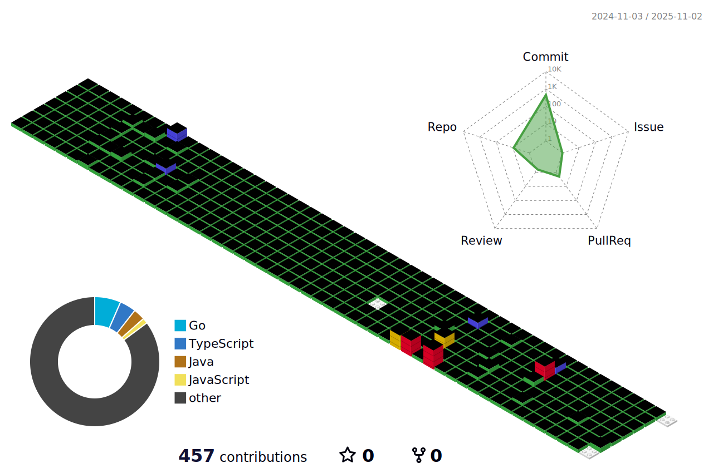

<code> Java</code>
<code> Python</code>
<code> JavaScript</code>
<code> Spring</code>
<code> Selenium</code>
<code> jQuery</code>
<code> redis</code>
<code> JPA</code>
<code> Oracle</code>
<code> MySQL</code>

